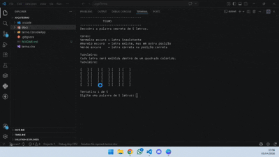

# 🎯 Termo.ConsoleApp

Aplicação de console desenvolvida em **C#** que recria o famoso jogo estilo **Wordle (Termo)**, onde o jogador deve adivinhar uma palavra secreta em até 5 tentativas.

---

## 📌 Sobre o Projeto

O **Termo.ConsoleApp** é um jogo interativo no terminal que desafia o jogador a descobrir uma palavra de 5 letras com base em dicas visuais por cores.

O projeto foi estruturado com foco em:

- ✔️ Boas práticas de programação
- ✔️ Separação de responsabilidades (SRP)
- ✔️ Refatoração com **Extract Method**
- ✔️ Organização em múltiplas classes
- ✔️ Código limpo e legível

---

## 🧠 Como Funciona

- O sistema sorteia uma palavra secreta.
- O jogador tem até **5 tentativas** para acertar.
- Após cada tentativa, o sistema fornece feedback visual com cores:

| Cor | Significado |
|-----|------------|
| 🟥 Vermelho escuro | Letra não existe na palavra |
| 🟨 Amarelo escuro | Letra existe, mas em outra posição |
| 🟩 Verde escuro | Letra correta na posição correta |

---

## 🖥️ Interface (Console)

O jogo simula um tabuleiro estilo Wordle:

[ ] [ ] [ ] [ ] [ ]

[ T ] [ E ] [ R ] [ M ] [ O ]

[ ] [ ] [ ] [ ] [ ]

Com cores aplicadas diretamente no console 🎨

---

## 🏗️ Estrutura do Projeto

Termo.ConsoleApp
├── Program.cs
├── JogoTermo.cs
├── PalavraService.cs
├── ValidadorEntrada.cs
├── AvaliadorTentativa.cs
└── Tabuleiro.cs

### 🔹 Program.cs
Responsável apenas por iniciar a aplicação.

---

### 🔹 JogoTermo.cs
Classe principal que controla toda a execução do jogo.

**Responsabilidades:**
- Loop principal do jogo
- Controle das tentativas
- Verificação de vitória/derrota
- Pergunta para jogar novamente

---

### 🔹 PalavraService.cs
Responsável por lógica relacionada às palavras.

**Responsabilidades:**
- Sorteio da palavra secreta

---

### 🔹 ValidadorEntrada.cs
Responsável por validar a entrada do usuário.

**Validações:**
- Entrada não vazia
- Tamanho correto (5 letras)
- Apenas letras (sem números/símbolos)

---

### 🔹 AvaliadorTentativa.cs
Responsável por comparar a tentativa com a palavra secreta.

**Responsabilidades:**
- Identificar letras corretas (verde)
- Letras fora de posição (amarelo)
- Letras inexistentes (vermelho)

---

### 🔹 Tabuleiro.cs
Responsável pela interface do jogo no console.

**Responsabilidades:**
- Renderizar tabuleiro
- Exibir tentativas com cores
- Desenhar quadrados estilo Wordle

---

## ⚙️ Tecnologias Utilizadas

- C#
- .NET
- Console Application
- `System.Security.Cryptography` (para geração aleatória)

---

## ▶️ Como Executar o Projeto

### 1. Clone o repositório

git clone https://github.com/ThiaggoSylva/jogoTermoTabajara.git

### 2. Acesse a Pasta

cd jogoTermo

### 3. Execute o projeto

dotnet run --project termo.ConsoleApp

## 🎮 Como Jogar
1. Execute o programa
2. Digite uma palavra de 5 letras
3. Analise as cores exibidas
4. Continue tentando até acertar
5. Escolha se deseja jogar novamente

## 🚀 Funcionalidades
- 🎯 Sistema de tentativas (5 chances)
- 🎨 Interface com cores estilo Wordle
- 📊 Histórico de tentativas em grade
- 🔁 Opção de jogar novamente
- 🔐 Validação robusta de entrada
- 🧩 Código modular e organizado

## 🧹 Boas Práticas Aplicadas
- ✔️ Single Responsibility Principle (SRP)
- ✔️ Extract Method
- ✔️ Separação por camadas
- ✔️ Código limpo (Clean Code)
- ✔️ Métodos pequenos e reutilizáveis

